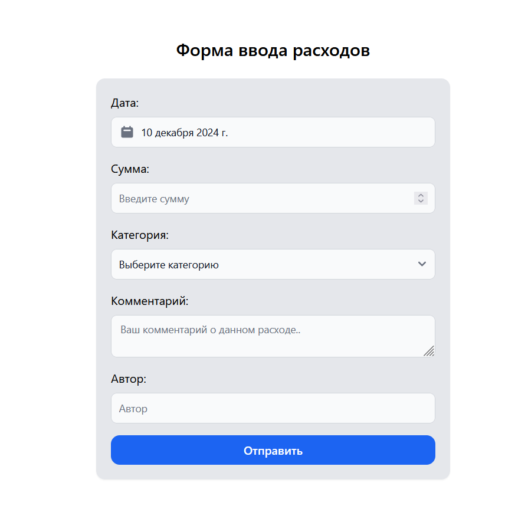
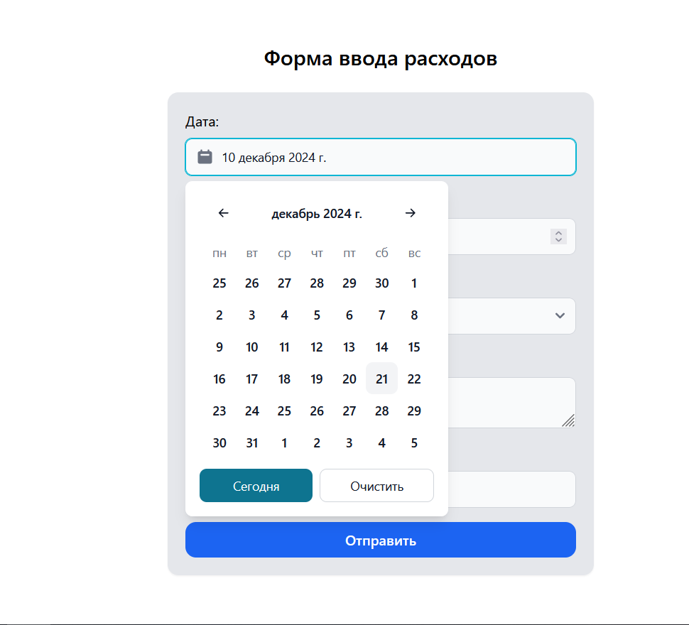
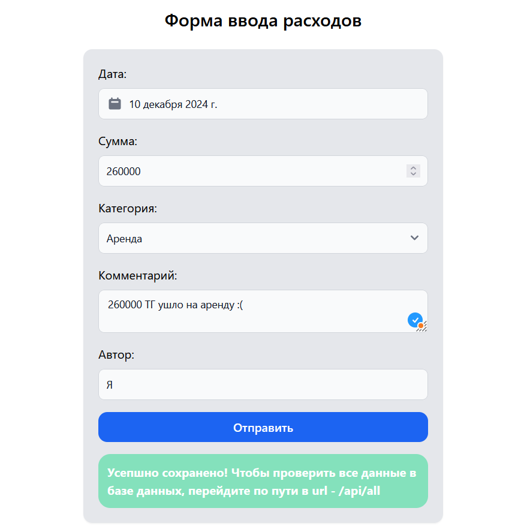
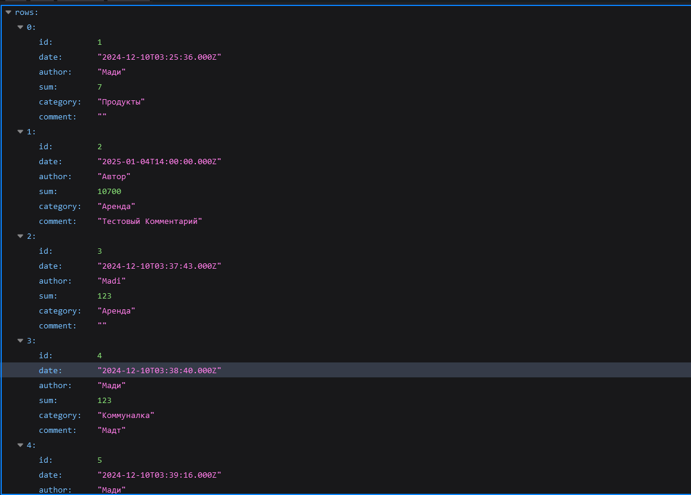

# Форма ввода расходов

## Описание проекта

Данный проект представляет собой веб-приложение для ввода и сохранения данных о расходах. Он был построен с использованием следующих технологий:

- **Frontend:** Vite + React, Tailwind CSS, FlowbiteReact
- **Backend:** Express.js
- **База данных:** MySQL

После ввода данных в форму они будут сохраняться в таблице MySQL. Для проверки всех записей можно перейти по маршруту `/api/all`.

---

## Установка проекта

Следуйте инструкциям ниже для установки и запуска проекта:

### **1. Клонирование проекта**
Склонируйте репозиторий в локальную директорию:
```bash
git clone https://github.com/mad1ly/Expenses_form
cd Expenses_form
```
---

### **2. Установка клиента (Frontend)**

Перейдите в директорию клиента и установите зависимости:
```bash
cd ./client
npm install
```

Запустите клиент:
```bash
npm run dev
```

---

### **3. Установка сервера (Backend)**

1. Укажите ваши данные для подключения к MySQL в файле /backend/db.js. Пример файла:
```bash
import mysql from 'mysql2';

const pool = mysql.createPool({
  host: 'localhost',
  user: 'ваш логин MySQL',
  password: 'пароль MySQL',
  database: 'expenses_form',
});

export default pool.promise();
```

2. Перейдите в папку backend и установите зависимости:
```bash
cd ./backend
npm install
```

3. Создайте таблицы в базе данных, выполнив следующий скрипт:
```bash
node createDB.js
```

4. Вернитесь в корневую директорию и запустите сервер:
```bash
cd ..
npm run dev
```

### Проверка данных**
После отправки данных из формы они будут сохранены в таблице MySQL. Для просмотра всех записей выполните GET-запрос по следующему маршруту:
```bash
http://localhost:3000/api/all
```

---

### Скриншоты**

### Форма


### Календарь


### Подтверждение отправки данных


### Все сохраненные данные по пути /api/all


---

### Контакты**

email: almaddevy@gmail.com
Мой сайт: https://madi-aliyev.netlify.app/

---

Удачного использования! 🎉
